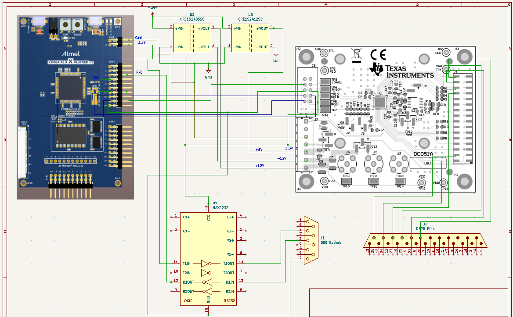

# PrecisionDAC

An analog-output hardware and firmware project using an ATxmega128A1U microcontroller and a DAC81408 evaluation module. The design connects MCU-controlled SPI configuration to a multichannel DAC, with a MAX3232 RS-232 interface and a multi-rail power supply.

## Design material

| Component | Role |
| --- | --- |
| ATxmega128A1U | Register-level peripheral control |
| DAC81408EVM | Eight-channel, 16-bit digital-to-analog conversion |
| MAX3232 | UART/RS-232 level translation |
| DB-25 connector | External interface |
| Power subsystem | Supply rails for the MCU and analog hardware |

## Repository contents

- [`firmware/main.c`](firmware/main.c): development source containing MCU clock setup, UART configuration, and SPI transactions for DAC configuration and channel writes.
- [`hardware/schematic/DAC_Schematic.png`](hardware/schematic/DAC_Schematic.png): system schematic.
- [`docs/`](docs/): board reference documents and images.

## Firmware status

The checked-in C file is an incomplete development snapshot. It requires source corrections and a complete target project before it can be built and used as firmware. A Microchip Studio solution and a reproducible build configuration are not included.

The hardware interface work and register routines are available for inspection. End-to-end command handling, bounds checking, initialization, and DAC transaction sequencing still need validation in the published version.

## Validation

Measured accuracy should be reported alongside channel, output range, requested code, measured voltage, load, instrument, and error calculation. A reproducible measurement record is not yet included, so this README does not claim a verified accuracy figure or industrial qualification.

## License

See [LICENSE](LICENSE).
